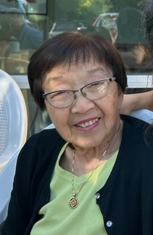

import Quote from '@components/Quote'

On Saturday, February 8th, the Puyallup Valley JACL welcomes you to our annual Day of Remembrance event, co-sponsored by [the Seattle Chapter of the JACL](http://seattlejacl.org/), [Tsuru for Solidarity](https://tsuruforsolidarity.org/), [Densho](https://densho.org), [the Japanese Cultural & Community Center of Washington](https://www.jcccw.org/), and [the Minidoka Pilgrimage Committee](https://www.minidokapilgrimage.org/).
The Day of Remembrance is a way to acknowledge and honor the over 125,000 people of Japanese descent who were incarcerated during World War II.

<Quote text="The Japanese American community comes together [for the Day of Remembrance] to not only reflect, but to tell our story, teach others, and lift up voices of our community. To share the charge to ensure that our country not only learns from, but never forgets its past." source="US Congresswoman Doris Matsui (D, 7th District of California)" />

This year's event will be held at the [Washington State Fair](https://thefair.com) Expo Hall.

## Event Details
* Parking – Free parking is available in [the Washington State Fair&rsquo;s Gold Parking Lot, 350 7th Ave SE, Puyallup](https://www.google.com/maps/place/Gold+Parking+Lot/@47.1861347,-122.2927766,573m/data=!3m2!1e3!4b1!4m6!3m5!1s0x5490fda161712e85:0x4d4d2b45c3e381db!8m2!3d47.1861311!4d-122.2901963!16s%2Fg%2F11s3345prv?entry=ttu&g_ep=EgoyMDI1MDExNC4wIKXMDSoASAFQAw%3D%3D)
* Free admission is at the Gold Gate, corner of S. Meridian & 9th Ave SW. Volunteers will guide you from the Gold parking lot through the Gold Gate entrance into the Expo Hall. 
* Time - Doors open at 10am, Program Starts at 10:30am and ends around 1pm.

## Program
 *	Land Acknowledgement
## Speakers
*	**Andrea Thayer** - WA State Fair, CFE
* **Eileen Yamada Lamphere** – President, Puyallup Valley JACL
* **Irene Fujii Mano** – Irene is Nisei (born in Seatttle) and the oldest child of Yoshito & Yukiko Shitamae Fujii who were first-generation Japanese immigrants. 
She and her family were sent to the “Puyallup Assembly Center” (PAC) then subsequently incarcerated at Minidoka concentration camp. 
"Minidoka Memoirs: The Untold Story from the Yoshito Fujii Files," a book written by [Ken Mochizuki](https://kenmochizuki.com/), chronicles her family's life before and during WWII at both the PAC and Minidoka, 
where her father served as Chairman of the Community Council. 

 

* **Stan Shikuma** – Leadership Council, Tsuru for Solidarity

After the program you will have the opportunity to meet the speakers and visit the newly built Remembrance Gallery. While the Expo Hall is heated, the Remembrance Gallery is not heated, so please dress appropriate to the weather.

Snacks, water and green tea will be provided. 

[**The Silent Fair**](/history/the-silent-fair) will be presented after the speakers. The short film shares the memories of 9 former incarcerees at the Puyallup Assembly Center.
