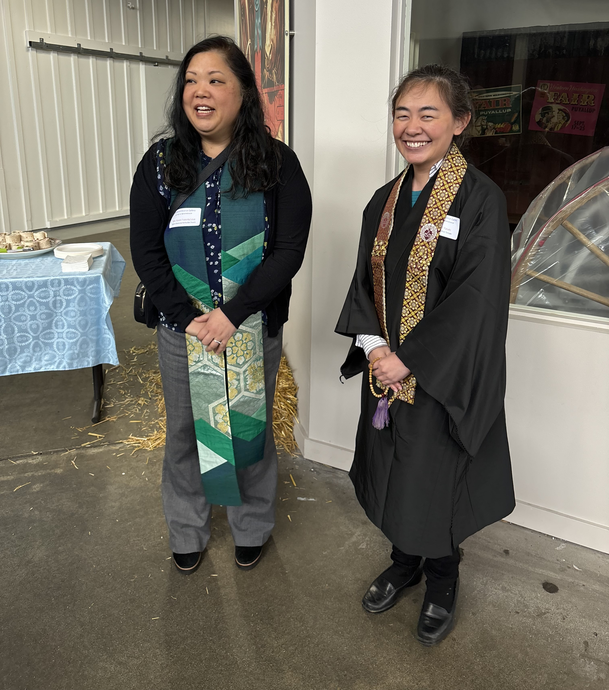
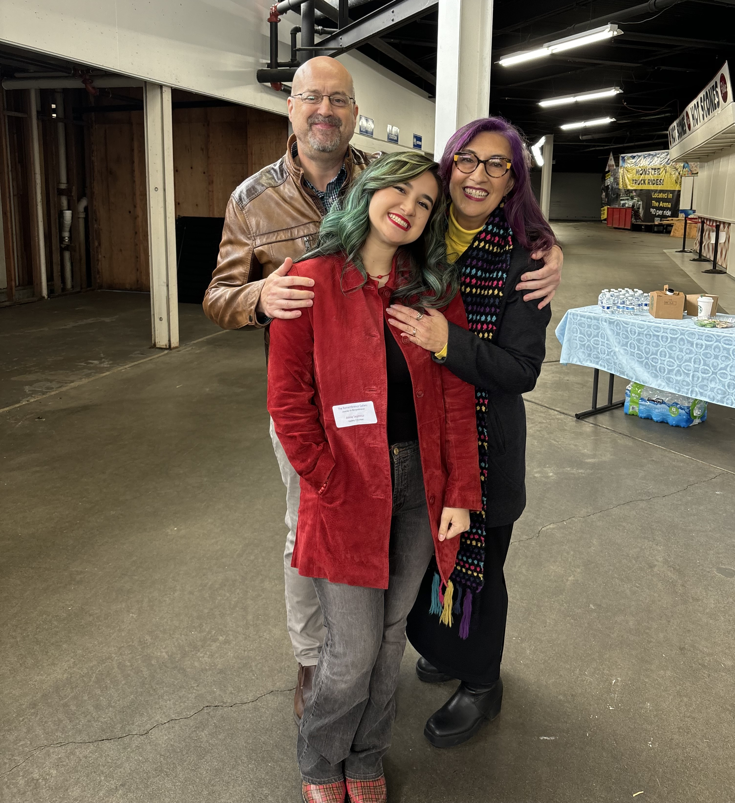

import ImgDescription from '@components/ImgDescription.astro'

We have reached a milestone. The Journey to Remembrance ceremony signifies construction of the Remembrance Gallery has begun.

<ImgDescription>From left to right: Eileen Yamada Lamphere, Mary Abo, Sean Ohashi, Fred Orton, Sharon Sobie Seymour</ImgDescription>

<ImgDescription>Reverend Karen Yokota Love and Reverend Cyndy Yasaki</ImgDescription>

<ImgDescription>Vern Henley, Tsuki Nomura-Henley, Bill Tashima</ImgDescription>

<ImgDescription>Front Anna Mariko Seymour, Back David Seymour, Sharon Sobie Seymour</ImgDescription>

<ImgDescription>Barb Mizoguchi Asahara, Jim Yamaguchi, Sharon Sobie Seymour, Penny Fukui, Frank Fukui, Eileen Yamada Lamphere, Liz Dunbar.</ImgDescription>

[See a recap of the ceremony by clicking here](https://drive.google.com/file/d/1Hn3flz1N2wKdN-4YpBm3tDzK3Wc1FFso/view?usp=drive_link)