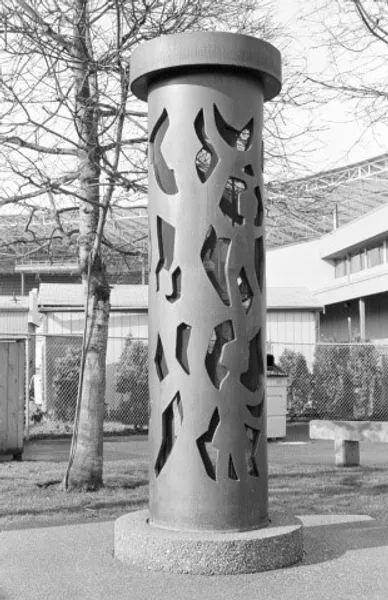

“Harmony” is a sculpture by [George Tsutakawa](https://en.wikipedia.org/wiki/George_Tsutakawa) located on the Washington State Fairgrounds near the location of the Remembrance Gallery. It is a memorial for the West Coast Japanese Americans who were interned during World War II. 

The sculpture is a column made of dark bronze containing figures of men, women and children are cut in silhouette into the sides of the column. The negative, open spaces form interesting patterns that shift as one examines the column from various angles.

> “I wanted to depict people of all races and creeds living in harmony. Then these sad things won't be happening over and over again,”
> 
> George Tsutakawa
>
> August 21, 1983

This sign was funded by a [National JACL](https://jacl.org) Legacy Grant in 2016.